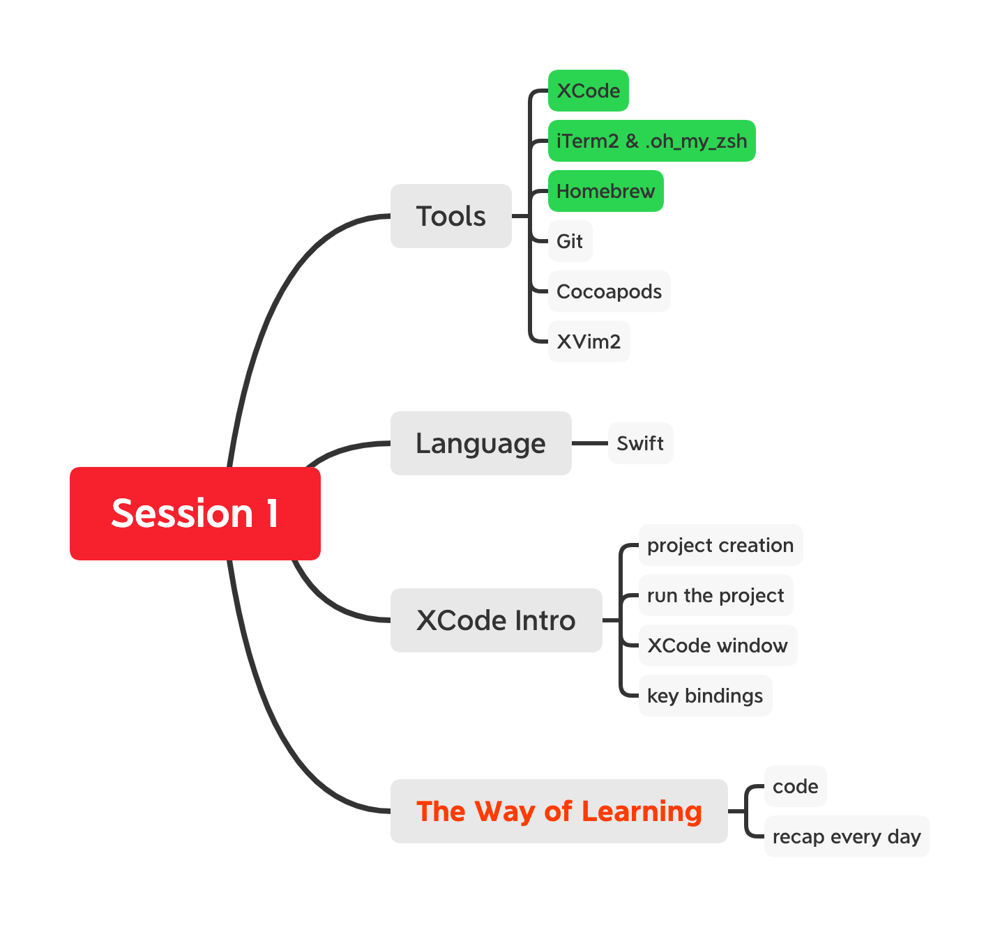
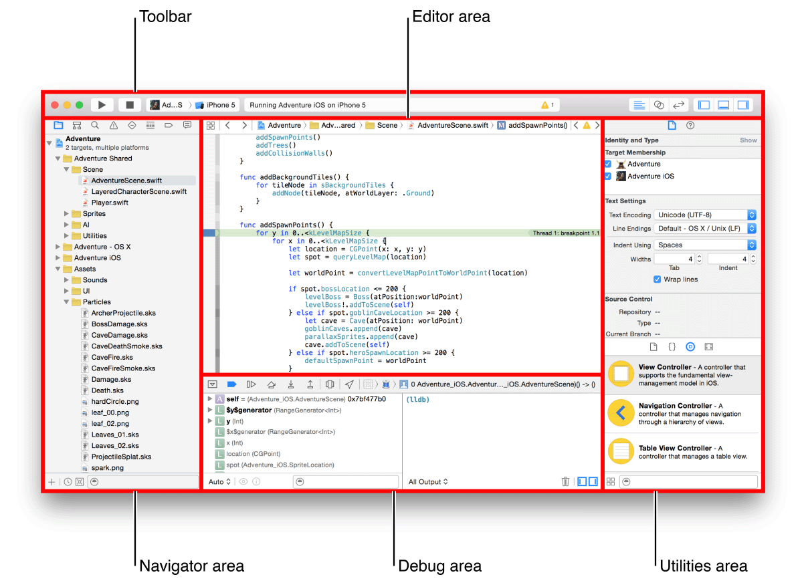

# S1

Key topics to cover in session 1. 

## Introduction

My name is Alex. Actually, I am a Chinese. I have been thinking about making a series of videos showing you how to develop an iOS application. 

### Difference 
- About 4 months of learning; constantly updated.
- Not a demo application, but a very complex one. Will be submitted to the App Store in the end. 
- Sorry about my English

## Questions before We Get Started

- How do you categorize yourself in terms of how much you are interested in iOS programming?
	- Passionate
	- Career Change
	- Want to try a little bit

- How much spare time do you have to learn this subject?
    	- more than 2-3 h/day
	- more than 1 h/day
	- less that 1 h/day
	
- Are you familiar with programming?
	- Web Development/Backend Developer
	- Know a few programming language, but haven't touched any project yet
	- Know nothing about programming
	
## Topics to cover

### Tools
- [x] XCode
- [x] iTerm2 & .oh_my_zsh
- [x] Homebrew
- [ ] git
- [ ] cocoapods
- [ ] XVim2(optional)

#### XCode

Xcode is Apple’s integrated development environment (IDE) that you use to build apps for Apple products including the iPad, iPhone, Apple Watch, and Mac. Xcode provides tools to manage your entire development workflow—from creating your app, to testing, optimizing, and submitting it to the App Store.

#### iTerm2

What is iTerm2?

iTerm2 is a replacement for Terminal and the successor to iTerm. 

What is a ternimal?

Terminals, also known as command lines or consoles, allow us to accomplish and automate tasks on a computer without the use of a graphical user interface. 

Graphical user interfaces (GUIs), allow you to to accomplish daily tasks by interacting with windows and icons, and are helpful for many tasks. However, for many tasks, we are better off entering text commands into the computer directly for more efficiency and flexibility. We usually do this through terminals.

My reasons to have it:

	- free software, open sourced
	- Autocomplete
	- Color schemes
	- Search

#### .oh\_my_zsh

[Oh My Zsh](https://github.com/ohmyzsh/ohmyzsh) is an open source, community-driven framework for managing your zsh configuration.

#### Homebrew

### Language

Swift will be used. 

### Create 'Poster'

'Poster' is the application we will be developing through out this tutorial. It's a picture collage application. 

Like ['PicCollage Grid & Photo Editor'](https://apps.apple.com/us/app/piccollage-photo-grid-editor/id448639966) on App Store.

#### XCode Project Creation

Shift + CMD + N

#### XCode interface - different areas

#### Running first program

#### XCode tips - key bindings

Some of the shortcuts I use frequently.

- Navigation Areas
	- CMD + 0 : file navigator 
	- CMD + option + 0 : attributes pane
	- CMD + shift + y : debugging area

- File Navigator
	- CMD + 0
	- CMD + Shift + j
	- CMD + Shift + o
	- CMD + control + right-arrow : Go forward
	- CMD + control + left-arrow : Go backward

- Editing
	- CMD + j : jump to editing area
	- Tab : completion
	- CMD + / : comment
	- CMD + \ : breakpoint

- Build & Run
	- CMD + b : build
	- CMD + r : run
	- CMD + shift + k: clean build
	- CMD + k : clear console

#### XVim & Github

XVim2 is a Vim plugin for Xcode. The plugin intends to offer a compelling Vim experience without the need to give up any Xcode features.

### The Way of Learning Recommended

- code along the way
- recap anything learned before sleep

### References
- [XCode Overview](https://developer.apple.com/library/archive/documentation/ToolsLanguages/Conceptual/Xcode_Overview/TheWorkspaceWindow.html#//apple_ref/doc/uid/TP40010215-CH25-SW1)
- [Swift](https://docs.swift.org/swift-book/)
- [iTerm2](https://www.iterm2.com)
- [HomeBrew](https://brew.sh/)
- [XVim2](https://github.com/XVimProject/XVim2)

