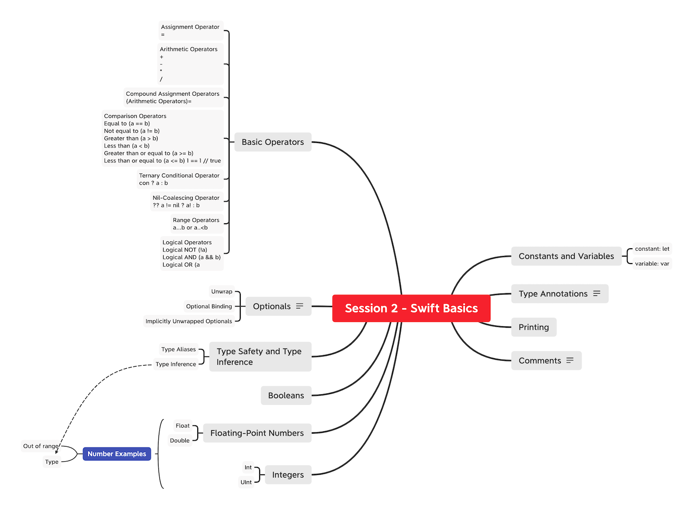

# S2

Key topics to cover in session 2. 



## Swift Basics - Tour

Session 2 will be all about [Swift](https://docs.swift.org/swift-book/).

Swift is a new programming language for iOS, macOS, watchOS, and tvOS app development. 

Swift is a type-safe language, which means the language helps you to be clear about the types of values your code can work with. If part of your code requires a String, type safety prevents you from passing it an Int by mistake. Likewise, type safety prevents you from accidentally passing an optional String to a piece of code that requires a non-optional String. Type safety helps you catch and fix errors as early as possible in the development process.

### Constants and Variables

The value of a constant can’t be changed once it’s set, whereas a variable can be set to a different value in the future.

#### Declaring Constants and Variables

```swift
let maximumNumberOfLoginAttempts = 10 //constant
var currentLoginAttempt = 0 //variable
```
This code can be read as:

“Declare a new constant called maximumNumberOfLoginAttempts, and give it a value of 10. Then, declare a new variable called currentLoginAttempt, and give it an initial value of 0.”

In this example, the maximum number of allowed login attempts is declared as a constant, because the maximum value never changes. The current login attempt counter is declared as a variable, because this value must be incremented after each failed login attempt.

```swift
var x = 0.0, y = 0.0, z = 0.0
```

> For beginners, always start by using constants as often as possible. Change it to a `var` when it's value needs to be updated. 

```
Question:
var currentLoginAttempt = 0 //variable
What's the type for variable 'currentLoginAttempt' ? 
```

### Type Annotations

You can provide a type annotation when you declare a constant or variable, to be clear about the kind of values the constant or variable can store. 

This example provides a type annotation for a variable called welcomeMessage, to indicate that the variable can store String values:

```
var message: String
message = "Hello, Swift."
```

It’s rare that you need to write type annotations in practice. If you provide an initial value for a constant or variable at the point that it’s defined, Swift can almost always infer the type to be used for that constant or variable.

### Printing Constants and Variables

You can print the current value of a constant or variable with the print(_:separator:terminator:) function:

```swift
print(message)
// Prints "Hello, Swift."
```
- string interpolation
``` swift
let swift = "Swift"
print("Hello, \(swift).")
// Prints "Hello, Swift."
```

The print(_:separator:terminator:) function is a global function that prints one or more values to an appropriate output. In Xcode, for example, the print(_:separator:terminator:) function prints its output in Xcode’s “console” pane. 


### Comments

Use comments to include nonexecutable text in your code, as a note or reminder to yourself. Comments are ignored by the Swift compiler when your code is compiled.

```
// This is a comment.
Multiline comments start with a forward-slash followed by an asterisk (/*) and end with an asterisk followed by a forward-slash (*/):
```

```
/* This is also a comment
but is written over multiple lines. */

/* This is the start of the first multiline comment.
 /* This is the second, nested multiline comment. */
This is the end of the first multiline comment. */
```

### Integers

Integers are whole numbers with no fractional component, such as 42 and -23. Integers are either signed (positive, zero, or negative) or unsigned (positive or zero).

Swift provides signed and unsigned integers in 8, 16, 32, and 64 bit forms. 

Integer Bounds
You can access the minimum and maximum values of each integer type with its min and max properties:

```swift
let minValue = UInt8.min  // minValue is equal to 0, and is of type UInt8
let maxValue = UInt8.max  // maxValue is equal to 255, and is of type UInt8 0b11111111
```
#### Int
In most cases, you don’t need to pick a specific size of integer to use in your code. Swift provides an additional integer type, Int, which has the same size as the current platform’s native word size:

On a 32-bit platform, Int is the same size as Int32.
On a 64-bit platform, Int is the same size as Int64.

Unless you need to work with a specific size of integer, always use Int for integer values in your code. This aids code consistency and interoperability. Even on 32-bit platforms, Int can store any value between -2,147,483,648 and 2,147,483,647, and is large enough for many integer ranges.

#### UInt

Swift also provides an unsigned integer type, UInt, which has the same size as the current platform’s native word size:

On a 32-bit platform, UInt is the same size as UInt32.
On a 64-bit platform, UInt is the same size as UInt64.

### Floating-Point Numbers

Floating-point numbers are numbers with a fractional component, such as 3.14159, 0.1, and -273.15.

Floating-point types can represent a much wider range of values than integer types, and can store numbers that are much larger or smaller than can be stored in an Int. Swift provides two signed floating-point number types:

Double represents a 64-bit floating-point number.
Float represents a 32-bit floating-point number.

>Double has a precision of at least 15 decimal digits, whereas the precision of Float can be as little as 6 decimal digits. The appropriate floating-point type to use depends on the nature and range of values you need to work with in your code. In situations where either type would be appropriate, Double is preferred.

### Number Examples

#### Range

```swift
let cannotBeNegative: UInt8 = -1
// UInt8 cannot store negative numbers, and so this will report an error
let tooBig: Int8 = Int8.max + 1
// Int8 cannot store a number larger than its maximum value,
// and so this will also report an error
```

#### Type

```swift
let twoThousand: UInt16 = 2_000
let one: UInt8 = 1
let twoThousandAndOne = twoThousand + UInt16(one)
```
Because both sides of the addition are now of type UInt16, the addition is allowed. The output constant (twoThousandAndOne) is inferred to be of type UInt16, because it’s the sum of two UInt16 values.

SomeType(ofInitialValue) is the default way to call the initializer of a Swift type and pass in an initial value. Behind the scenes, UInt16 has an initializer that accepts a UInt8 value, and so this initializer is used to make a new UInt16 from an existing UInt8. 

```swift
let three = 3
let pointOneFourOneFiveNine = 0.14159
let pi = Double(three) + pointOneFourOneFiveNine
// pi equals 3.14159, and is inferred to be of type Double
```

```swift
let integerPi = Int(pi)
// integerPi equals 3, and is inferred to be of type Int
```
Floating-point values are always truncated when used to initialize a new integer value in this way. This means that 4.75 becomes 4, and -3.9 becomes -3.

### Booleans

Swift has a basic Boolean type, called Bool. Boolean values are referred to as logical, because they can only ever be true or false. Swift provides two Boolean constant values, true and false:

let orangesAreOrange = true
let turnipsAreDelicious = false

Boolean values are particularly useful when you work with conditional statements such as the if statement:

```swift
if turnipsAreDelicious {
    print("Mmm, tasty turnips!")
} else {
    print("Eww, turnips are horrible.")
}
// Prints "Eww, turnips are horrible."
```

Conditional statements such as the if statement are covered in more detail in Control Flow.

Swift’s type safety prevents non-Boolean values from being substituted for Bool. The following example reports a compile-time error:

```swit
let i = 1
if i {
    // this example will not compile, and will report an error
}
```

### Type Safety and Type Inference

Swift is a type-safe language. A type safe language encourages you to be clear about the types of values your code can work with. If part of your code requires a String, you can’t pass it an Int by mistake.

#### Type Inference

If you don’t specify the type of value you need, Swift uses type inference to work out the appropriate type. Type inference enables a compiler to deduce the type of a particular expression automatically when it compiles your code, simply by examining the values you provide.

Type inference is particularly useful when you declare a constant or variable with an initial value. This is often done by assigning a literal value (or literal) to the constant or variable at the point that you declare it. (A literal value is a value that appears directly in your source code, such as 42 and 3.14159 in the examples below.)

```swift
let meaningOfLife = 42 // meaningOfLife is inferred to be of type Int
let pi = 3.14159 // pi is inferred to be of type Double
let anotherPi = 3 + 0.14159 // anotherPi is also inferred to be of type Double
```

If you combine integer and floating-point literals in an expression, a type of Double will be inferred from the context:

### Optionals

You use optionals in situations where a value may be absent. An optional represents two possibilities: Either there is a value, and you can unwrap the optional to access that value, or there isn’t a value at all.

Here’s an example of how optionals can be used to cope with the absence of a value. Swift’s Int type has an initializer which tries to convert a String value into an Int value. However, not every string can be converted into an integer. The string "123" can be converted into the numeric value 123, but the string "hello, world" doesn’t have an obvious numeric value to convert to.

The example below uses the initializer to try to convert a String into an Int:

```swift
let possibleNumber = "123"
let convertedNumber = Int(possibleNumber)
// convertedNumber is inferred to be of type "Int?", or "optional Int"

var serverResponseCode: Int? = 404
// serverResponseCode contains an actual Int value of 404
serverResponseCode = nil
// serverResponseCode now contains no value

var ten = 10
ten = nil //error
```
> Swift’s nil the absence of a value of a certain type. 

#### If Statements and Forced Unwrapping

If an optional has a value, it’s considered to be “not equal to” nil:

```swift
if convertedNumber != nil {
    print("convertedNumber contains some integer value.")
}
// Prints "convertedNumber contains some integer value."

if convertedNumber != nil {
    print("convertedNumber has an integer value of \(convertedNumber!).")
}
// Prints "convertedNumber has an integer value of 123."

let optionalInt: Int? = nil
print("the value of optionalInt \(optionalInt!).")
```

>Trying to use ! to access a nonexistent optional value triggers a runtime error. Always make sure that an optional contains a non-nil value before using ! to force-unwrap its value.

#### Optional Binding
You use optional binding to find out whether an optional contains a value, and if so, to make that value available as a temporary constant or variable. 

Write an optional binding for an if statement as follows:

```swift
if let constantName = someOptional {
    statements
}

if let firstNumber = Int("4"), let secondNumber = Int("42"), firstNumber < secondNumber && secondNumber < 100 {
    print("\(firstNumber) < \(secondNumber) < 100")
}
// Prints "4 < 42 < 100"
// You can include as many optional bindings and Boolean conditions in a single if statement as you need to, separated by commas. If any of the values in the optional bindings are nil or any Boolean condition evaluates to false, the whole if statement’s condition is considered to be false. The following if statements are equivalent:
```

#### Implicitly Unwrapped Optionals

Sometimes it’s clear from a program’s structure that an optional will always have a value, after that value is first set. In these cases, it’s useful to remove the need to check and unwrap the optional’s value every time it’s accessed, because it can be safely assumed to have a value all of the time.

These kinds of optionals are defined as implicitly unwrapped optionals. 

```swift
let assumedString: String! = "An implicitly unwrapped optional string."
let implicitString: String = assumedString // no need for an exclamation point

let optionalString = assumedString
// The type of optionalString is "String?" and assumedString isn't force-unwrapped.

let assumedString: String! = nil 
let implicitString: String = assumedString // error

let assumedString: String! = nil 
let optionalString = assumedString //no runtime error

if assumedString != nil {
    print(assumedString!)
}
// Prints "An implicitly unwrapped optional string."

if let definiteString = assumedString {
    print(definiteString)
}
// Prints "An implicitly unwrapped optional string."
```

>Don’t use an implicitly unwrapped optional when there’s a possibility of a variable becoming nil at a later point. Always use a normal optional type if you need to check for a nil value during the lifetime of a variable.

## Basic Operators

An operator is a special symbol or phrase that you use to check, change, or combine values.

| Operators  | Symbols  | Example  |
|---|:---:|---|
| Assignment Operator  | =  | let b = 10; var a = 5; a = b  |
| Arithmetic Operators  | + <br> - <br> * <br> / <br> %  | 1 + 2       // equals 3 <br> 5 - 3       // equals 2 <br> 2 * 3       // equals 6 <br> 10.0 / 2.5  // equals 4.0 <br> 9 % 4    // equals 1 |
| Compound Assignment Operators  | (Arithmetic Operators)=  | var a = 1 <br> a += 2 <br> // a is now equal to 3 |
| Comparison Operators  | Equal to (a == b) <br> Not equal to (a != b) <br> Greater than (a > b) <br> Less than (a < b) <br> Greater than or equal to (a >= b) <br> Less than or equal to (a <= b)  | 1 == 1   // true <br> 2 != 1   // true <br> 2 > 1    // true <br> 1 < 2    // true <br> 1 >= 1   // true <br> 2 <= 1   // false |
| Ternary Conditional Operator | con ? a : b | let contentHeight = 40 <br> let hasHeader = true <br> let rowHeight = contentHeight + (hasHeader ? 50 : 20)  |
| Nil-Coalescing Operator |  ??  | a != nil ? a! : b  |
| Range Operators | a...b or a..<b  | for index in 1...5 { <br> print("\(index) times 5 is \(index * 5)") <br> }  |
| Logical Operators | Logical NOT (!a) <br> Logical AND (a && b) <br> Logical OR (a || b)  |  |

### References
- [Swift](https://docs.swift.org/swift-book/)


